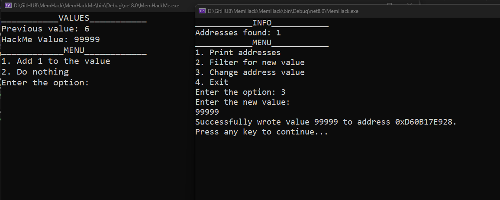
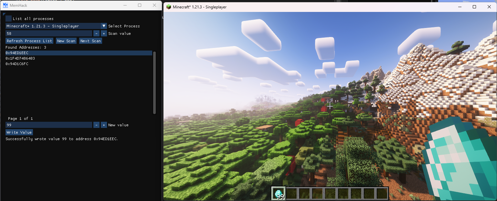

# MemHack
 

MemHack is a Cheat Engine clone written in C#. It provides the basic functionalities of reading and writing to a process memory. This project was made for educational purposes along with a YouTube video that shows the process of making it. 

## MemHackConsole

## MemHackGUI

# Features to consider: 
Most of these were taken from Youtube comments and Discord suggestions.

- [x] Linux 
	- [ ] Flatpack version
- [ ] Memory mapping
- [x] Ability to select a process or a window
- [ ] Pointer scanning
- [ ] Lua scripting support
- [ ] Value type selector
- [ ] Strings support 
- [ ] Dll injection 

Other things to consider: 
- [x] CI/CD 
- [ ] Unit testing 

# Project Structure

### **MemHackConsole**  
  A console version of MemHack, primarily used for debugging purposes.

### **MemHackGUI**  
  The main project, featuring a GUI for a more user-friendly experience with additional features.

### **MemHackLib**  
  A shared library containing the core functionalities of MemHack, used by both `MemHackConsole` and `MemHackGUI`.

### **MemHackMe**  
  A simple console application for testing MemHack.

### **Monogame.ImGuiNet**  
  A fork of the `ImGui.NET` library, used by `MemHackGUI` to create its graphical user interface.

### Credits
Huge inspiration from LLGD: 
https://github.com/meemknight/memGrab
https://youtu.be/47xNiBMVSvU
